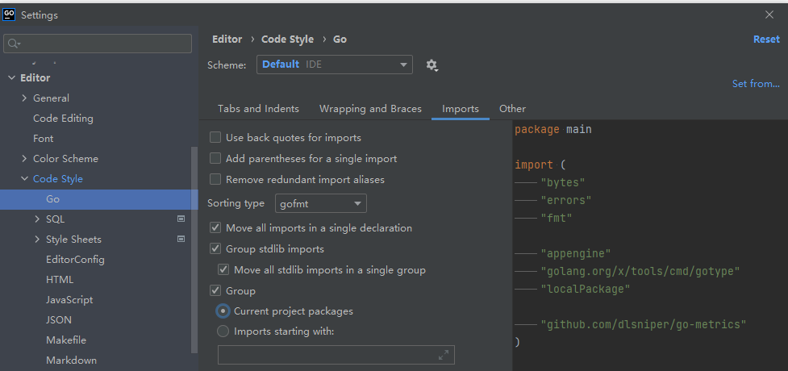

### 1 主要
#### 1.1：注意事项
```
面向接口编程
1：*******.md  
   存在上面标识的：代表每次迭代都必须写readme的地方
2：serviceinterface 和 repointerface
   必须注明负责人：即最后的维护人;以及作用
3：infrastucture->api
   必须注明负责人; 以及作用
4：对应的接口命名方式为
   领域+动作的方式（比如pageBuildingAdd)
5：尽量避免
   一个方法处理的东西即是又是；一个变量的含义是什么也可以是什么  
   尽量做成一对一的关系
```
#### 1.2：目录结构
```
    ├── main.go             (项目启动位置)
    ├── internal            (主要代码实现)
    ├── config              (项目基本配置;   提交到git上的不能是能够使用的配置,而是配置获取的方式一个demo,比如从哪里获取 或者 谁负责这个配置)
    ├── resource            (某些静态文件存放路径)
    │   ├── goland              (goland的一些基础配置）
    │   ├── vscode              (vscode的基础配置;)      
    │   ├── build               (项目部署,打包docker等的文件） 
    │   ├── sql                 (*******.md 注意：迭代的sql） 
    │   └── iteration           (*******.md 注意：迭代） 
    └── others...
    
    //主业务(领域)
    ├── xxx1            (xxx1  描述)  主负责人-(xxx)
    ├── xxx2            (xxx2  描述)  主负责人-(xxx)
    ├── xxx3            (xxx3  描述)  主负责人-(xxx)
    └── xxx4            (xxx4  描述)  主负责人-(xxx)
    
    
    //以下为internal里面主要分层目录；
    ├── controller              (请求层/gin层;)       
    ├── grpc                    (grpc;)     
    ├── backend                 (后台任务(或者叫做cron)---没有即可忽略)
    │   ├── ...                 (*******.md 具体领域的后台任务--对接的是 serviceinterface或者command 交互层 ··如果业务单一 这一层可去掉··)
    ├── command                 (交互层):   一般情况下都是controller直接调取domain层；但是如果出现了领域之间的交互；那么就是controller调取command层，command实现交互逻辑
    │   ├── ...                 (具体领域 当前command主要归属于那个domain的功能--  ··如果业务单一 这一层可去掉··)
    │   │   ├── cmd             (数据变更记录等操作）
    │   │   └── query           (查询相关操作;)       
    ├── domain                  (领域层;)(领域)    
    │   ├── ...                 (*******.md 具体领域--     ··如果业务单一 这一层可去掉··)
    │   │  ├── client           (请求与响应实体层;)     
    │   │  │  ├── request       (grpc生成-入参结构体; 入参验证;)                        
    │   │  │  └── view          (grpc生成-出参结构体; 出参设定;)  
    │   │  ├── serviceinterface (service接口;)   
    │   │  ├── serviceimpl      (业务逻辑-实现层--处理request,中间调用repointerface,最后返回view;)                        
    │   │  ├── repointerface    (repo接口;)   
    │   │  ├── repoimpl         (数据交互,提供serviceimpl的数据源，与缓存(数据库)或者其他地方进行交互;)   
    │   │  │  └── xxx_suffix.go (默认suffix是没有的即postgres数据库的交互;如果是kafka 或者 redis 等 则以 xxx_kafka.go 或者 xxx_redis.go 结尾)
    │   │  ├── consts           (内部领域指定const,非公共部分;)   
    │   │  ├── model            (数据库定义)       
    │   │  ├── exception        (错误信息;)    
    │   │  └── mock             (mock数据;)      
    ├── infrastucture           (业务逻辑;其他地方不写逻辑)      
    │   ├── api                 (其他SDK引用：是引用然后微处理--尽量在这里统一引用;如果不是现成sdk，尽量在api 或者我们自己的sdk里面去处理)     
    │   │  └──...               (具体的api分类  比如 广告基建adi 或者 其他平台的 stripe,google等;)
    │   ├── grpc                (grpc的调取)   
    │   ├── common              (model与service用到的通用函数,如果内部没有公共的utils的话 就用这个;如果有的话 尽量使用内部公共的)   
    │   ├── query               (通用的查询与grpc生成-的通用结构体;)     
    │   ├── db                  (数据库链接)       
    │   ├── config              (config定义成接口的形式；能够实现通用--拆到了最外层试用 最后看情况丢到common/config里面去) 
    │   └── cache               (缓存;)     
    └── 其他                     (可能的其他存在)       
    
```
#### 1.3：流程图
请求流程图 


### 2 项目介绍
#### 2.1 项目简介
```
项目的简介
```
#### 2.2 最新文档
[最新开发文档](https://alidocs.dingtalk.com/i/nodes/xxxxx)

[最新项目文档](https://alidocs.dingtalk.com/i/nodes/xxxx?utm_scene=team_space)

[接口文档](https://app.apifox.com/project/xxxxxx) (贡献者: <a href="https://github.com/gwsee/go-app-field">gwsee</a> )

[项目地址](https://github.com/gwsee/go-app-field)
#### 2.3 产品历史

[v1.0.000](https://alidocs.dingtalk.com/i/nodes/Qnp9zOoBVBe5wjopcgPAMGPjW1DK0g6l?utm_scene=team_space)

### 3 主要功能 todo  自己修改
- authorization： 广告账户相关授权
```
  开发者账户管理
  授权账户绑定开发者账户，获取相应的TOKEN
```
- customer：广告账户管理
```
  customer
  account
  relation
  
  主要是绑定授权账户和广告账户的对应关系
```
- campaign: 广告活动相关管理
```
  campaign
  adgroup
  ad
```
- report：广告报表获取
```
  report
```

### 4 部署方式
#### 4.1 重要
```
对应不同的系统一定要调整对应的config.yml文件
不能将自己的或者一些可用的上传到git上
```
#### 4.2 测试环境
```bash
# todo 待修正
# docker打包
docker build - f ./Dockerfile
# 创建postgres
sh ./config/postgres.sh
# 创建后台服务
sh ./config/run.sh
```

### 5 软件设置
#### 5.1 goland

自动go fmt

打开file > settings > tools > file watchers


格式化import

打开file > settings > Editor > Code Style > Go

#### 5.2 vscode
```
vscode的相关配置
```
